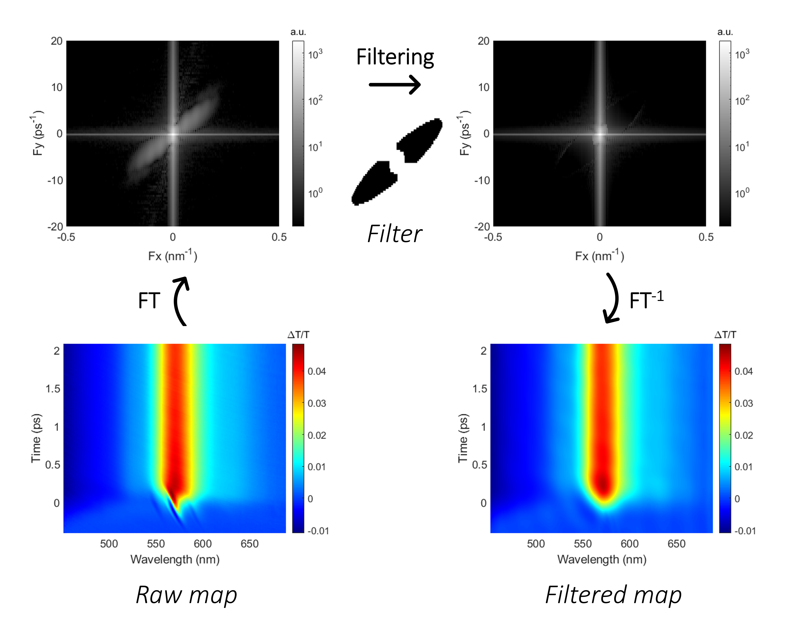

[github-repo]: https://github.com/laboratoiredebiophotonique/transient_grating_artifact_filter.git

## Transient gradient artifact filtering in the Fourier domain on 2D time-resolved spectroscopy map

<!---Badges-->
<!--- [](https://doi.org/10.1021/acsphotonics.2c01968) -->
[](#)
[](https://www.python.org/downloads/release/python-380/)
[](https://github.com/laboratoiredebiophotonique/transient_grating_artifact_filter/blob/master/LICENSE)
[](https://www.usherbrooke.ca/ln2/recherche/photonique-integree)

- Removal of coherent artifacts is important in the analysis of time and wavelength resolved spectroscopy data.
By taking advantage of the strong correlation between spectra acquired sequentially in time, artifact removal can be
formulated as a 2D problem for improved effectiveness. This code implements a 2D method to remove transient grating
coherent artifacts from femtosecond time-resolved spectroscopy data based on filtering in the Fourier domain,
leading to better estimation of the material parameters from the measured data.
- Algorithmic steps:
  - Separate the input image (time-resolved spectroscopy map) into "smooth" and
  "periodic" components ([Moisan, 2010](https://link.springer.com/article/10.1007/s10851-010-0227-1)) to reduce the effect of the "cross"
  pattern at the center of the Discrete Fourier transform due to the non-periodic nature
  of the image.

  - Filter the artifact from the periodic component in the Fourier domain using
  an elliptically-shaped stop-band with a pass-band at the center to preserve the
  low-frequency content of the baseline data. Additional pass-band areas can be added to
  fine-tune the filtering (see *Optional parameters* below). The process to build the
  filter is described in detail in the *Filter* class declaration. 

  - Recombine the filtered periodic component with the smooth component.

  - Apply a light gaussian low-pass filter to remove any remaining
  high frequency noise.




**Reference**: coming soon!

## Usage:
```
transient_grating_artifact_filter(fname, lambda0_pump, artifact_extent_lambda, artifact_extent_t, threshold_ellipse, threshold_center_pass_band)
```

- **Required parameters**:

  - *fname* (str): input file name in the *data* subdirectory containing the following data (see examples files in the *data*
  subdirectory):
    - *Data*: *nt* (rows) x *nλ* (columns) spectroscopy measurements (arbitrary units)
    - *Wavelength*: *nλ* wavelength samples (nm)
    - *Time*: *nt* time samples (ps)
    - NB: The script can accommodate non-uniformly sampled data in time and/or wavelength.

  - *Artifact* class object parameters (see class definition for details):
    - *lambda0_pump* (float): pump central wavelength (nm)
    - *artifact_extent_t* (float): artifact extent in time (ps)
    - *artifact_extent_lambda* (float): artifact extent in wavelength (nm)

  - *Filter* class object parameters (see class definition for details):
    - *threshold_ellipse* (float): threshold for filter elliptical stop band pixel identification
    and clustering ([0..1])
    - *threshold_center_pass_band* (float): threshold for filter central pass-band pixel identification
    and clustering ([0..1])
    - NB: *threshold_center_pass_band* > *threshold_ellipse*


- **Optional parameters**:
  - *lambda_time_profile* (float): Wavelength at which the time line-profile is 
                    plotted (nm, if 0 default to *lambda0_pump*).
  - *cross_pass_band_width* (int) = width of a cross-shaped pass-band in the filter along the
                    horizontal and vertical axes of the Fourier plane to pass
                    (i.e. not filter) any remaining non-periodic content left over from the
                    smooth/periodic decomposition (default = 0, i.e. no cross pass-band).
  - *upper_left_lower_right_quadrant_pass_band* (bool): enable/disable filter pass-band
                    areas for upper-left and lower-right quadrants of the Fourier plane, excluding the
                    horizontal and vertical axes (default = True).
  - *gaussian_blur_sigma* (float): standard deviation of the gaussian blur used for the
                    final low-pass filtering (default = 3.0).


- **Output**: Plot displays and files written to the *output* subdirectory (created automatically if it doesn't exist)


- **Debugging/tuning**:
  - The *threshold_ellipse* and *threshold_center_pass_band* parameters must be adjusted to
    reach the optimal compromise between removing the artifact and preserving the 
    underlying baseline spectroscopy data.
  - The script draws a cross-hair pattern based on the *artifact_extent_t* and *artifact_extent_lambda* 
    parameters over the elliptical portion of the filter mask identified with *threshold_ellipse*.
    The *artifact_extent_t* and *artifact_extent_lambda* parameters can be fine-tuned to line up the cross-hair
    with the ellipse axes to compensate for uncertainties in these parameters.

**Examples**: run the script *transient_grating_artifact_filter_exec.py* or the notebook *transient_grating_artifact_filter_exec.ipynb*.

## Installation

* Checkout the repository

```
git clone https://github.com/laboratoiredebiophotonique/transient_grating_artifact_filter.git
```

* Install all prerequisite modules
```
pip install -r requirements.txt
```
* The moisan2011 package is required, it can either be installed automatically as above via *requirements.txt*
or manually from [GitHub](https://github.com/sbrisard/moisan2011).